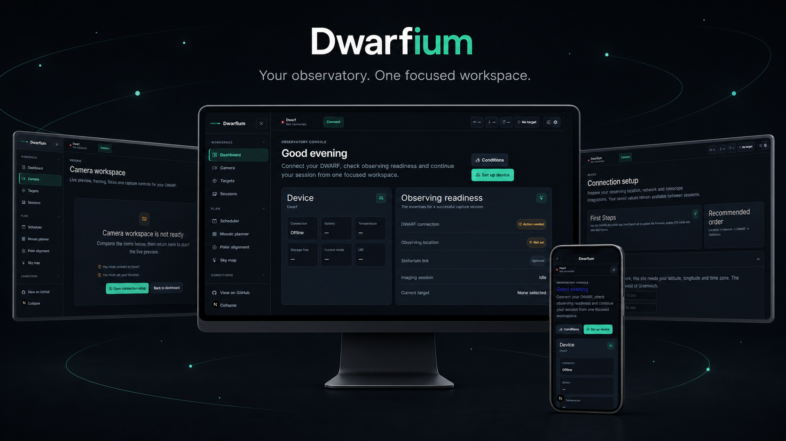
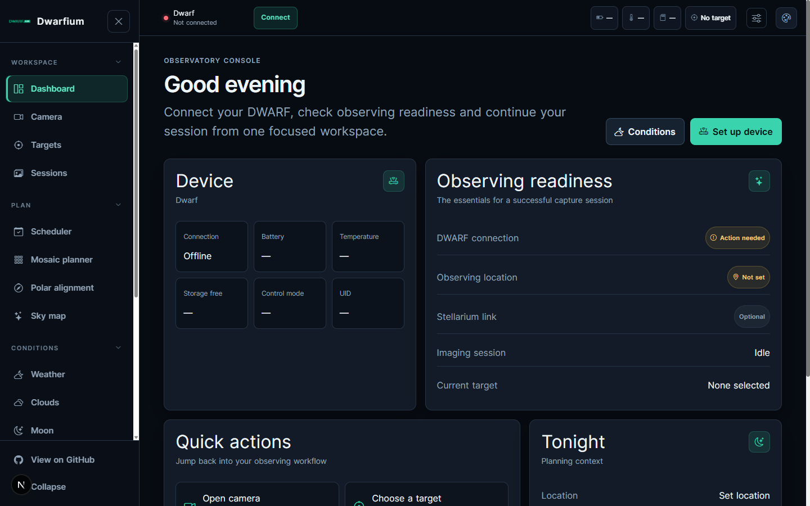
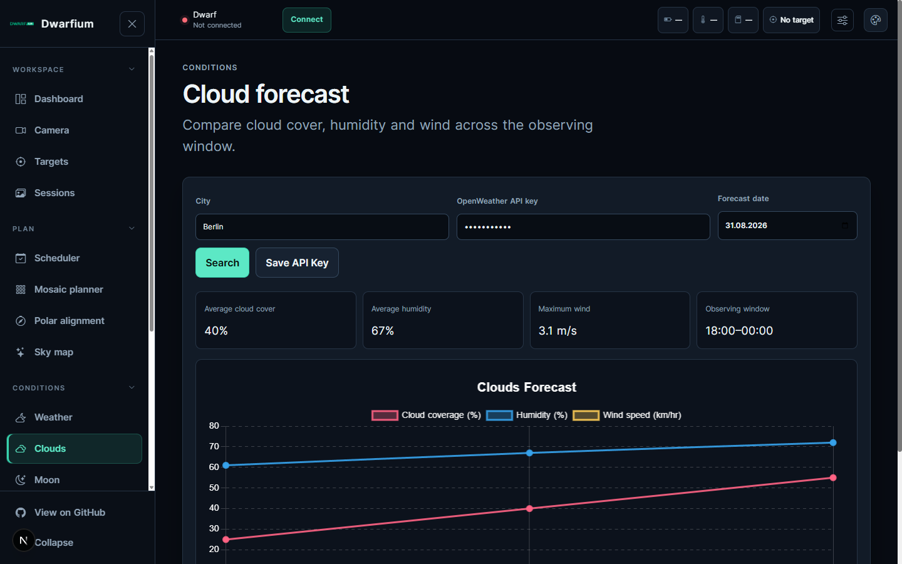

# Dwarfium

<p align="center">
  A modern observatory workspace for DWARF II, DWARF 3, and DWARF Mini telescopes.
</p>

<p align="center">
  <a href="https://github.com/acocalypso/dwarfium/actions/workflows/build.yml"></a>
  <a href="https://github.com/acocalypso/dwarfium/releases"></a>
  <a href="LICENSE"></a>
  <a href="https://github.com/acocalypso/dwarfium/releases"></a>
  <a href="https://discord.gg/5vFWbsXDfv"></a>
</p>



Dwarfium brings telescope control, observing plans, sky conditions, and diagnostics into one responsive application. The same interface runs in a browser and as a Tauri desktop app, with a persistent status bar for connection, battery, temperature, storage, target, and capture state.

Dwarfium uses the shared V3 WebSocket protocol (major 1, minor 20), discovers the telescope model before creating packets, and applies the correct device identity for every supported model.

## What you can do

- Connect and control DWARF II, DWARF 3, and DWARF Mini telescopes.
- Preview the camera, manage imaging sessions, and inspect captured files.
- Find targets, send GOTO commands, and connect Stellarium.
- Build observing schedules and mosaic plans.
- Use polar alignment and an interactive sky map.
- Review weather, cloud, Moon, and astronomy-calendar conditions.
- Edit images, inspect logs, and troubleshoot the device connection.
- Work comfortably on desktop, tablet, or mobile layouts without decorative background images.

## The new interface

### Observatory dashboard

The dashboard surfaces telescope readiness, tonight's conditions, upcoming targets, and recent sessions without hiding critical device state.



### Guided connection setup

Setup follows the order the hardware needs: observing location, Wi-Fi configuration over Bluetooth, telescope connection, and optional Stellarium integration.

### Cloud forecast

The conditions workspace presents a clear observing window, current metrics, and an hourly cloud forecast with explicit loading, empty, and error states.



The desktop sidebar collapses at narrower widths and becomes a keyboard-accessible drawer on mobile. The supported Tauri window minimum is 820 × 640. See [UI architecture](docs/UI_ARCHITECTURE.md) for layout, responsive behavior, and component conventions.

## Install a release

Download the latest desktop or standalone package from [GitHub Releases](https://github.com/acocalypso/dwarfium/releases).

- **Desktop app:** the recommended experience. It bundles the local proxy and MediaMTX services used for telescope communication and video streaming.
- **Standalone web package:** useful for a local server or another machine on the telescope's network.
- **Browser development:** requires a Chromium-based browser for Web Bluetooth. Bluetooth access also requires a secure context (`https://` or `localhost`).

macOS builds are currently unsigned and receive more limited hardware testing than Windows and Linux. If macOS quarantines an app you trust, remove the quarantine attribute after moving it to Applications:

```bash
xattr -d com.apple.quarantine /Applications/Dwarfium.app
```

## Connect a telescope

Before the first connection, use the DWARFLAB mobile app to update the telescope firmware, enable STA mode, and capture any required dark frames.

1. Open **Setup** and save your observing location.
2. In **DWARF network mode**, connect over Bluetooth and provide the Wi-Fi network that Dwarfium uses.
3. After the telescope reboots, connect Dwarfium and the telescope to the same local network.
4. In **Connect your DWARF**, confirm the detected model and IP address, then select **Connect**.
5. Configure Stellarium only if you plan to use external GOTO control.

Only one controller can act as the telescope host. If you previously used the DWARFLAB app, disable **Set Current Device as Host**, close the app, and turn off Wi-Fi on that phone before connecting Dwarfium.

If Web Bluetooth reports that no supported service was found, confirm that you selected the DWARF device rather than a nearby accessory, keep the telescope close to the computer, and retry after power-cycling it. The desktop app or local proxy is the more reliable connection path when browser Bluetooth is unavailable.

## Development

### Prerequisites

- Node.js 24 and npm (the versions used by CI)
- Rust stable and the [Tauri 2 platform prerequisites](https://v2.tauri.app/start/prerequisites/) for desktop development
- Git

### Browser

```bash
git clone https://github.com/acocalypso/dwarfium.git
cd dwarfium
npm ci
npm run dev
```

Open [http://localhost:3000](http://localhost:3000).

### Tauri desktop

```bash
npm run tauri dev
```

The Tauri configuration starts Next.js automatically and launches the native window when the development server is ready.

### Validate changes

```bash
npm run CI
```

This runs ESLint, Prettier checks, TypeScript validation, and Jest tests.

### Production builds

```bash
# Web/standalone application
npm run build

# Native desktop bundle for the current platform
npm run tauri build
```

Release artifacts for Linux x64, Linux ARM64, Windows x64, and Tauri desktop targets are assembled by the manually triggered [build workflow](https://github.com/acocalypso/dwarfium/actions/workflows/build.yml).

## Architecture

Dwarfium is built with Next.js 16, React 18, TypeScript, and Tauri 2. A Node.js proxy handles local telescope communication, while MediaMTX provides the DWARF 3 video stream.

Protocol access is centralized in `src/services/dwarf`; UI components must not import `dwarfii_api` directly. See the [V3 migration report](MIGRATION_REPORT.md) for protocol decisions, command mappings, and the hardware validation plan.

For a remote web deployment, run the Dwarfium proxy on a computer in the telescope's local network. A private VPN such as Tailscale can connect that machine to the web server without exposing the telescope or proxy directly to the public internet.

## Contributing

Issues and pull requests are welcome. Before opening a pull request, run `npm run CI` and verify the affected flow in both a browser and Tauri when possible. Hardware-specific reports should include the telescope model, firmware version, platform, connection method, and relevant logs with credentials removed.

## License

Dwarfium is available under the [MIT License](LICENSE).

## Community

Join the [DWARF Discord community](https://discord.gg/5vFWbsXDfv) for setup help, observing discussion, and project feedback.
