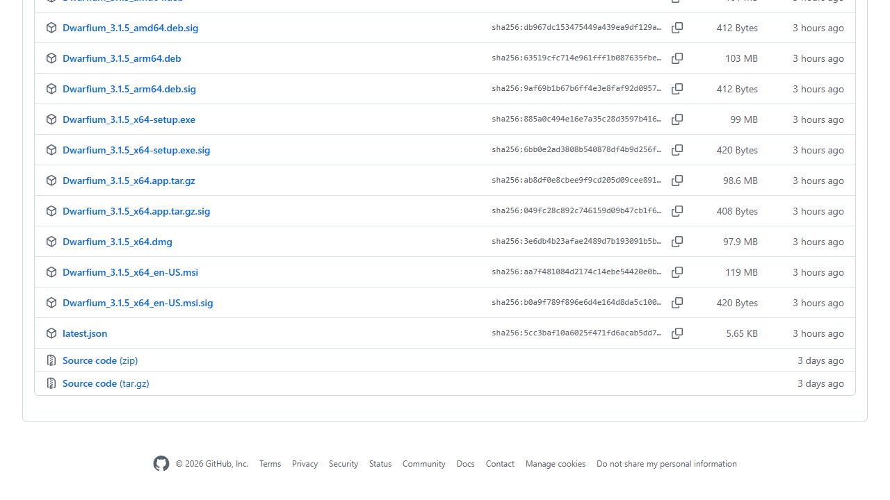
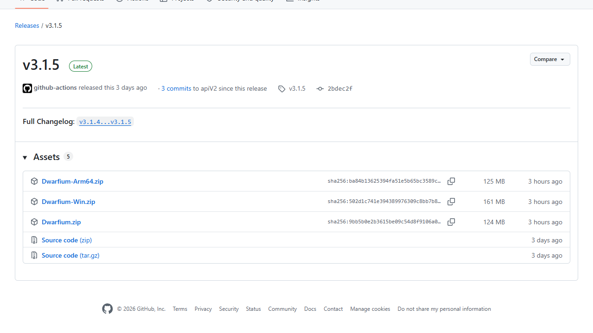
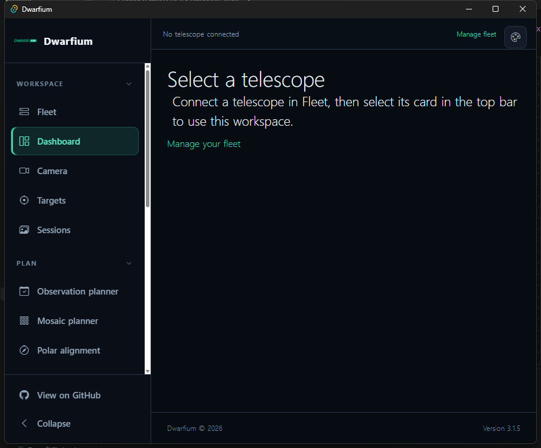
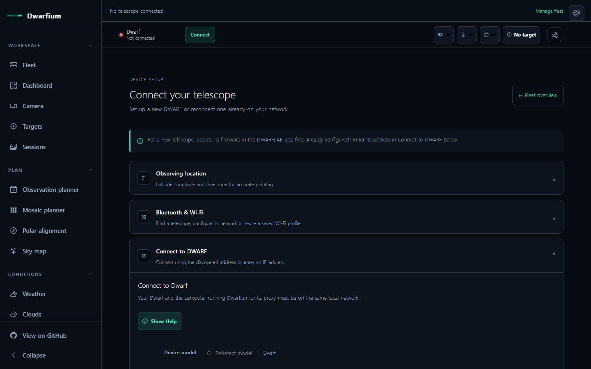
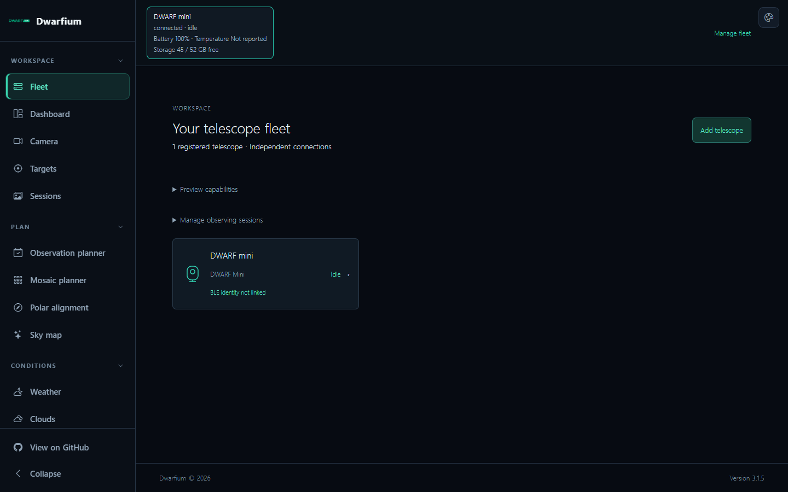
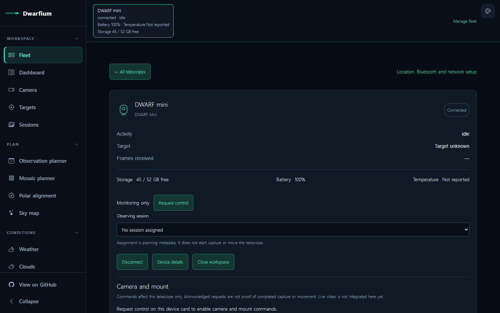

# Getting started with Dwarfium 3.1.5 (Windows)

This guide covers the two Windows downloads: the desktop installer (`.exe` or `.msi`) and the standalone ZIP. **If you just want to use Dwarfium on one Windows PC, choose the desktop installer.** You do not need Git, Node.js, or the source-code ZIP.

The screenshots below were captured from version 3.1.5 with a powered-on DWARF Mini. Its address, battery, storage, and ownership state are examples, not values to enter on your own PC. Dwarfium also supports DWARF II and DWARF 3.

## Choose the right download

| What you want                        | Download                                                                                                                                                                                                                                                     | What starts the app                                |
| ------------------------------------ | ------------------------------------------------------------------------------------------------------------------------------------------------------------------------------------------------------------------------------------------------------------ | -------------------------------------------------- |
| Normal Windows desktop app           | [Windows `.exe` installer](https://github.com/acocalypso/dwarfium/releases/download/app-v3.1.5/Dwarfium_3.1.5_x64-setup.exe) or [Windows `.msi` installer](https://github.com/acocalypso/dwarfium/releases/download/app-v3.1.5/Dwarfium_3.1.5_x64_en-US.msi) | **Dwarfium** from the Start menu                   |
| Portable, browser-based local server | [Dwarfium-Win.zip](https://github.com/acocalypso/dwarfium/releases/download/v3.1.5/Dwarfium-Win.zip)                                                                                                                                                         | `Dwarfium\launch-server&tools.bat`, then a browser |

The installers are on the [desktop-app release](https://github.com/acocalypso/dwarfium/releases/tag/app-v3.1.5); the ZIP is on the [standalone release](https://github.com/acocalypso/dwarfium/releases/tag/v3.1.5). On either page, expand **Assets** if necessary. Do not choose **Source code (zip)**: it is for developers and does not contain a ready-to-run app. The `.sig` and `latest.json` files are not installers.

## Option A: install the desktop app (`.exe` or `.msi`)

1. Download **one** Windows installer from the table above. The `.exe` and `.msi` are alternative installers for the same desktop app; you do not need both.
2. Open the downloaded installer and follow its prompts. If Windows asks whether to allow local-network access, allow it on your trusted private network so Dwarfium can reach the telescope. Do not expose the proxy to the public internet.
3. Open **Dwarfium** from the Windows Start menu. The desktop app starts its bundled proxy and MediaMTX video helper automatically. You do **not** launch `DwarfiumProxy.exe` yourself; it is a background service with no main window.
4. Confirm that the Dwarfium window opens. A first launch with no telescope selected looks like this:

Continue with [Connect a telescope](#connect-a-telescope) below. If you installed an older build and the helper services do not start, close Dwarfium and reinstall from the 3.1.5 desktop-app release.

## Option B: run the standalone Windows ZIP

The standalone package serves Dwarfium in a browser and requires **Python 3 with pip** for its local web server. The launcher attempts to install the Python `flask` package if it is missing, so internet access may be needed on first launch. [Install Python for Windows](https://www.python.org/downloads/windows/) if `python` is not available in a Command Prompt; enable **Add python.exe to PATH** during installation.

1. Download `Dwarfium-Win.zip` from the standalone release. In File Explorer, right-click the ZIP and choose **Extract All**. Do not run individual tools from the ZIP preview.
2. Open the extracted **Dwarfium** folder. Double-click **`launch-server&tools.bat`**. This starts the proxy, MediaMTX, and the Python web server. The proxy and MediaMTX may appear only as minimized/background processes; neither is the user interface.
3. Open **Chrome or Edge** and visit **<http://127.0.0.1:8000>** on that same PC. Use this local address, not port 3000 (which is for development). Chrome/Edge are also needed for the Web Bluetooth setup path; another browser may load the app but lack that feature.
4. Keep the local services running while you use Dwarfium. If the page does not load, see [Troubleshooting](#faq-and-troubleshooting).

The connection setup page in the browser has separate sections for location, Bluetooth/Wi-Fi, and the DWARF network connection:

**Do not double-click `DwarfiumProxy.exe` expecting a window.** It is just the network helper. The batch launcher starts all three required components, and the browser displays the app.

## Connect a telescope

1. Power on your DWARF and update its firmware in the DWARFLAB mobile app if needed. For first-time network setup, use **Connection** in Dwarfium to save your observing location and configure the telescope's Wi-Fi/STA connection over Bluetooth. The telescope and the PC running Dwarfium must then be on the same local network.
2. If the telescope already has a local IP address, open **Fleet → Add telescope**. Enter a friendly name and its _current_ IP address, and choose its model (or let Dwarfium identify it when connecting). Registration alone does not take control or start capture.
3. Open the telescope's Fleet card and select **Connect**. Once it connects, select its card in the top bar to use it across the workspace. The device IP may change after a router restart; edit the address on the Fleet card or redetect it with Bluetooth if you saved its BLE identifier.
4. Check the connection state before using Camera, Targets, or Sessions. If the card says **Monitoring only**, another controller may be the host. Close the DWARFLAB phone app, disable **Set Current Device as Host** there, or temporarily turn off that phone's Wi-Fi, then use **Request control** in Dwarfium.

This real Mini connection was **idle** and reported battery and free storage, but temperature was not reported by the device at that moment. It was in monitoring-only mode; no capture or movement was started for these screenshots.

## FAQ and troubleshooting

### “Connection failed! DWARF transport closed (code 4409)”

The DWARF closed the WebSocket connection. In this project's DWARF protocol probe, **4409 is treated as `DEVICE_OCCUPIED`**: another controller, often the DWARFLAB phone app, is holding the host connection. This matches the community report where switching the phone's Wi-Fi off resolved the problem. Close the phone app, turn off its **Set Current Device as Host** option, or disconnect that phone from Wi-Fi, then reconnect in Dwarfium. If Dwarfium reaches the telescope in monitoring-only mode, use **Request control**. Also close duplicate Dwarfium windows or other automation connected to the same DWARF. The numeric code comes from the device-side connection; Dwarfium currently displays it without a friendly explanation.

### “DWARF transport closed (code 1006)”

`1006` indicates an abnormal WebSocket closure, **not** the specific host-occupied condition above. Confirm the telescope is still powered on, both devices remain on the same Wi-Fi/LAN, and the Fleet IP is current. Check that the local proxy is running; then reconnect. If it repeats, note the time and collect the sanitized entries from **Logs** (remove Wi-Fi passwords and other credentials before sharing).

### “Cannot reach device discovery” or “No proxy detected”

Bluetooth discovery can find the telescope and its IP, but the app still needs the local proxy for network discovery and control. In the desktop app, close and reopen **Dwarfium** and check whether `DwarfiumProxy.exe` starts automatically. In the standalone package, run **`launch-server&tools.bat`** from the extracted folder, rather than `DwarfiumProxy.exe` alone. Check that security software or a firewall is not blocking localhost or the telescope's local IP. The desktop app normally manages its helpers; the standalone launcher does not install a Windows service.

### “I opened `DwarfiumProxy.exe` and nothing happened”

That executable has no app window. Use the **Dwarfium** Start-menu entry for the installed version, or use the standalone **`launch-server&tools.bat`** and then open <http://127.0.0.1:8000> in Chrome/Edge.

### The standalone page at `127.0.0.1:8000` does not open

Make sure you extracted the ZIP, ran its batch launcher from the `Dwarfium` folder, and have Python 3 on PATH. The launcher checks for `python`; the Python server needs Flask and may try to install it on first run. Port 8000 must be free. If the launcher closes or the page remains unavailable, run the batch file from a Command Prompt so you can read the Python/Flask error, or use the desktop installer instead.

### Web Bluetooth cannot find the telescope

Use current Chrome or Edge, turn on PC Bluetooth, keep the DWARF nearby, and select the DWARF's advertised device rather than another accessory. Web Bluetooth is not available in every browser. If the telescope is already on your Wi-Fi, you can enter its local IP in Fleet and connect through the proxy without repeating Bluetooth setup.

### Why does Fleet say “Monitoring only” or “Temperature not reported”?

**Monitoring only** means Dwarfium is connected but does not currently own camera/mount control; request control only after releasing any competing phone or app host. **Temperature not reported** means no usable temperature value was received for that device at that time. It is not a fabricated zero; battery and storage can still be available, as in the Mini screenshot above.

### Does Dwarfium support DWARF Mini and DWARF 3?

Yes. Select the right model or let Dwarfium identify it at connection time. Device-specific capabilities and telemetry may differ. These screenshots use a Mini because it was powered on during documentation; they do not imply that only Mini is supported.

## When asking for help

Include the Dwarfium version, Windows version, telescope model and firmware, whether you used desktop or standalone, whether another phone/app is connected, and the exact error text. Share relevant **Logs** entries only after removing Wi-Fi credentials, private IPs you do not want public, and any other secrets.
