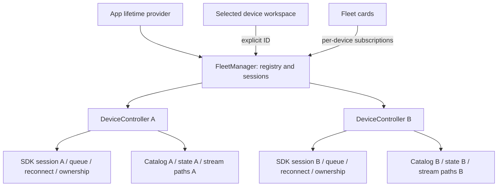

# Fleet architecture and migration audit

Status: foundation in progress, not a working multi-device release.
Baseline: `apiV2` commit `343bc99`, branch `fleet`, 2026-09-08.
Baseline `npm run CI`: lint, formatting, typecheck, 21 suites / 190 tests passed.
No hardware commands are needed for this foundation. Prior D3 read-only evidence
does not certify simultaneous capture, movement, or the D2 current profile.

## Single-device assumption audit

This is the initial source audit, not a claim that every legacy call has been
migrated. The protocol residual inventory remains an additional migration gate.

| Location | Current Assumption | Multi-Device Problem | Proposed Change |
|---|---|---|---|
| `src/pages/_app.tsx` | One ConnectionContextProvider around all pages | All workspaces share one telescope | App-lifetime FleetManager, device-scoped workspace adapter |
| `src/stores/ConnectionContext.tsx`, `src/types.d.ts` | One IP, socket, model, ownership, camera, focus, capture, target, error and log | Notifications and controls share mutable destination/state | Move runtime ownership into controllers; split site preferences from device state |
| `src/hooks/useLoadIntialValues.ts` | Restore one saved device and imaging configuration | Cannot restore registry independently | Versioned registry migration; transient state starts unknown/offline |
| `src/hooks/useSetupConnection.ts` | One restoration flag and connection context | Selection may drive connection lifecycle | Controllers outlive routes; explicit per-device connect intent |
| `src/lib/connect_utils.ts` | Installs handlers into one context, requests ownership on ready | Another connect replaces displayed state and ownership | Per-controller subscriptions/generation; explicit ownership policy |
| `src/services/dwarf/connection.ts` | Instance facade, but old callbacks consume one context | Partial isolation does not isolate consumers | Reuse SDK instance lifecycle; scoped callbacks and teardown |
| `src/services/dwarf/api.ts` | configureDwarfProtocol changes legacy SDK globals | Last configured model/client can affect another device's packets | Fleet uses current instance-based SDK only; retire global packet creators |
| `dwarfii_api/src/current_session.ts`, `current_websocket.ts` | Already instance-owned queue, generation, state, reconnect | Safe building blocks, not an app-wide isolation guarantee | One instance per registered controller; never share queues |
| `src/services/dwarf/cameraParams.ts` | Global catalog maps, scope, epoch and subscription | Reading B invalidates A's catalogs | Per-controller catalog service with generation-bound HTTP cancellation |
| `src/services/dwarf/capture.ts` | Socket guard is per socket, inputs use single context | UI settings or catalog can come from another selection | Immutable device-bound capture inputs and owned catalog |
| `src/services/dwarf/telemetry.ts`, `mediaState.ts`, `mountState.ts` | Mostly pure normalization | Caller still controls destination | Reuse pure decoders inside originating controller only |
| `src/lib/dwarf_utils.ts`, `photo_utils.ts` | Context-selected settings and residual legacy packet helpers | Camera commands may use global model state | Controller methods; migrate unsupported legacy operations before enabling |
| `src/components/imaging/*`, `DwarfCameras.tsx` | Local pending UI, joystick timers and global context | Late actions survive selection change | Bind device ID and generation at action start, cancel UI timers on unmount |
| `src/lib/goto_utils.ts` | Context target, calibration, timers and legacy command builders | Wrong-device GOTO/abort or stale target | Device-owned operation handles, explicit coordinate provenance |
| `src/components/astroObjects/*`, `GotoLists.tsx`, `GotoUserLists.tsx`, `GotoStellarium.tsx`, asteroid controls | Target actions use ambient connection | Destination is implicit | Require selected registered ID; shared catalogs remain global |
| `src/pages/skymap.tsx`, `src/lib/observation_planner_transfer.ts` | Single FOV/context and one transfer slot | Framing and execution device can differ | Include device ID/profile and coordinate units in transfer |
| `src/components/shared/CalibrationDwarf.tsx`, `EQSolving.tsx`, `PolarAlign.tsx` | Single mount result/context | Calibration from A can appear on B | Controller-owned mount state and device-labeled results |
| `src/components/scheduler/*`, `src/pages/image-session.tsx` | Plans/preferences and active imaging session lack fleet assignment | Logical plans can be confused with hardware execution | Separate observing-session metadata from controller capture execution |
| `src/components/asteroids/api/store.ts` | Redux stores RTK Query asteroid API only | Adding telescope fields here is not an existing normalization strategy | Keep catalog Redux; dedicated per-device external stores |
| `src/components/shared/StatusBar.tsx`, `Layout.tsx`, `Nav.tsx`, `src/pages/index.tsx` | One status bar, error banner and device destination | No fleet visibility or explicit command destination | Fleet overview plus device-aware workspace heading |
| `DwarfIIStatus.tsx`, `LogMessages.tsx`, `src/lib/logger.ts` | One telemetry/log context and storage key | Errors/messages cannot be attributed safely | Device ID on every event; bounded device logs |
| `src/db/db_utils.ts` | IPDwarf, connectionStatus, astroSettings, imagingSession and logMessages singleton keys | Restart can restore stale state; settings collide | Versioned fleet key, UUID records and scoped preferences; preserve old keys |
| `src/components/setup/ConnectDwarf*.tsx`, `CmdHostLockDwarf.tsx` | Discovery overwrites one configured device | Discovery/registration/connect/ownership conflated | Add-to-registry separate from connection and control requests |
| `src/lib/get_dwarf_type.ts` | device-name suffix used as UI UID | Neither model number nor suffix is verified unique hardware identity | Persist local UUID; retain name only as identity hint |
| `src/lib/get_dwarf_type.ts`, `get_proxy_url.ts` | Updates/checks fixed dwarf_tele and dwarf_wide paths | Connecting B changes A's video source | Stable UUID-derived path names and device-scoped path lifecycle |
| `install/config/`, `src-tauri/mediamtx*.yml`, preview components | Fixed shared MediaMTX paths and one server | Video collisions persist across packaged builds | One server can serve many paths; verify path API and every consumer |
| `server/server.ts` | WS targetSocket is scoped to client connection | Proxy is not inherently singleton; frontend targets still are | Preserve per-client socket pair, test close/error isolation |
| `src/pages/api/proxy.ts`, BLE API routes and packaged BLE helpers | Generic target proxy; BLE workflow assumes one active setup | Concurrent discovery writes/setup can collide | Preserve stateless targets; serialize physical BLE setup separately |
| `src-tauri/src/main.rs`, packaging scripts | Shared proxy/MediaMTX sidecars | Must not spawn one server per telescope | Keep app-owned sidecars, controller-owned paths; validate packaged config |
| Weather, location, themes, catalog favorites, Stellarium | Global application integrations/preferences | Not all global state is device state | Keep appropriate global state, bind telescope-consuming actions explicitly |

## Identity and domain

SDK `normalizeCurrentDeviceInfo` exposes hardware model ID and reported name, not
a verified serial. IDs 1/2/4 are model identifiers; wire ID 4 is not identity.
Research `dwarfAlp` session routing similarly does not establish a stable serial
contract. Do not deduplicate by model, name, BLE browser ID, or IP automatically.
Start with persisted local UUIDs and explicit registration. Keep reported name and
last endpoint as hints; updating either must preserve the UUID. Later verified
hardware identifiers need source/model validation and explicit collision handling.

Registry metadata is separate from runtime state. One device has zero or one
assigned observing session; many devices may share a session. Assignment does not
invoke a controller or change capture/target authority. Selection is an ID only,
not a socket owner. Removing a running controller must require explicit disconnect.

## Proposed ownership

Use cached immutable snapshots and per-device subscriptions. React's
`useSyncExternalStore` requires stable unchanged snapshots and a matching server
snapshot for hydration (validated through Context7, React official reference).
No connection or browser storage access during server rendering.

The Pages Router build can be statically exported. Prefer `/cameras?device=<uuid>`
and equivalent existing pages over unknown build-time dynamic device paths.
Missing/invalid IDs must not silently route physical commands to another device.
The legacy workspace stays single-device until its command and stream boundaries
are migrated; do not expose a misleading fleet selector over it.

## Information matrix

R = research/schema supported, runtime presence required; L = prior live read-only
D3 evidence; U = unverified. R is not a successful hardware test, especially D2.

| Field | Mini | D3 | D2 | Source | Reliability | Show in Fleet? |
|---|---|---|---|---|---|---|
| Alias | Yes | Yes | Yes | Registry | APPLICATION KNOWN | Always |
| Model | R | L | R | Successful deviceInfo hardware ID | DEVICE AUTHORITATIVE | Icon + label, unknown until known |
| Stable serial | U | U | U | No verified SDK contract | UNKNOWN | No; internal local UUID |
| Reported name | R | R | R | deviceInfo | DEVICE AUTHORITATIVE / CACHED offline | Details |
| Firmware | U | U | U | Needs verified field mapping | UNKNOWN | Only after verification |
| Battery/charging | R | L | R | 16405 nested state | DEVICE AUTHORITATIVE | Present values only |
| Temperature | R | L | R | 16405 / 15243 / optional CMOS 15292 | DEVICE AUTHORITATIVE | Present values, preserve source |
| Storage | R | L | R | Valid 16405 storage | DEVICE AUTHORITATIVE | Details; verify units |
| Shooting mode | R | L | R | 16405 | DEVICE AUTHORITATIVE | Details, not evidence of active capture |
| Capture state/progress | R | R | R | 15208/15236, 15209, 15288 | DEVICE AUTHORITATIVE | After scoped state mapping |
| Planned frame count | R | R | R | Session/catalog or device progress | APPLICATION KNOWN / DEVICE AUTHORITATIVE | Label planned vs reported |
| Exposure/gain/filter | R | R | R | Runtime catalogs / 15264 | DEVICE AUTHORITATIVE | Compact capture detail, no model-static fallback |
| Stacking | R | R | R | Requires verified active-state mapping | UNKNOWN until mapped | Do not infer from capture ACK |
| Focus/motor activity | R | R | R | Verified scoped notification states | DEVICE AUTHORITATIVE | Only while current evidence applies |
| RA/Dec, Alt/Az | R | R | R | Mount/solve notifications | DEVICE AUTHORITATIVE | Details with units and freshness |
| Human target name | U | U | U | No verified device name contract | UNKNOWN | Session-known target separately labeled |
| Last GOTO target | Yes | Yes | Yes | Accepted app command | APPLICATION KNOWN | Historical, never assumed current capture |
| IP/proxy mode | Yes | Yes | Yes | Connection configuration | APPLICATION KNOWN / CACHED | Details |
| Ownership | R | R | R | SDK 15223 lock + mode state | DEVICE AUTHORITATIVE | Control/read-only/unknown |
| Network quality | U | U | U | No verified quality field | UNKNOWN | Do not invent signal bars |

Reuse `DwarfDeviceProfile` for model labels/capabilities; advertised catalogs win
over display fallbacks. Mini/D3/D2 filters differ. Model icons must have distinct
silhouettes and text, not color-only coding.

## Activity, targets, streams, persistence

Connection: disconnected, connecting, connected, reconnecting, error. Connected
means SDK-ready, not HTTP/WS-open. Activity separately starts unknown, with idle,
slewing, focusing, capturing, stacking and busy enabled only by verified states.
Transport errors do not prove a physical capture stopped. Cached last activity
must be marked stale on disconnect, never counted as current authoritative status.

Target priority: verified device metadata, active session-known target, accepted
GOTO target, reported coordinates, unknown. Preserve provenance, generation and
timestamp. Session assignment is planned metadata, not proof that a device points
there. A last GOTO is historical unless current execution evidence links it.

Streaming migration must use UUID-derived names across path creation, update,
health checks, players, overlay, shutdown, proxy and packaged configs. Verify
MediaMTX's installed path API before implementation. No automatic live fleet wall.

Persist only versioned registry/session metadata, preferences and last-known
endpoint/identity hints. Never persist sockets, ownership or authoritative runtime
activity. Preserve old keys and migrate idempotently only after successfully saving
the new registry. Corrupt or future-version data must not be silently overwritten.

## Implementation sequence and gates

1. Registry/domain foundation: UUIDs, aliases, metadata sessions, immutable lookup,
   selection independence and unit tests. No production connection changes.
2. Controller instances using current SDK; isolated HTTP catalogs, event reducers,
   ownership, errors, targets and generations. No legacy global packet creators.
3. Scope all camera/focus/motor/GOTO/stop controls and MediaMTX consumers; tests
   proving A commands/events/reconnect cannot affect B.
4. Versioned persistence and non-destructive single-device migration; app-lifetime
   provider and static-export-compatible routing.
5. Responsive Fleet cards, icons, summary, aliases, session assignment and explicit
   device workspace. Offline entries remain visible. Unknown stays unknown.
6. Isolated mock fleets 1/2/4/8, UI and concurrent operation tests, production build,
   browser and Tauri runtime validation. Record actual results, not inferred passes.

Release gates still open: live multi-device operation, all command routes, streams,
persistence migration, Fleet UI, performance, production build and Tauri runtime.

## Foundation checkpoint

Implemented `src/services/fleet/registry.ts`: immutable cached metadata snapshots,
UUID collision protection, aliases, model metadata, endpoint updates preserving
identity, independent selection and many-device observing-session assignment.
The registry has no transport dependency and is not yet mounted in the application.
Removal is deferred until FleetManager can enforce controller disconnection.

Added `src/__tests__/services/fleetRegistry.test.ts`: 11 tests covering identity,
all three models, unknown model, selection/assignment isolation, invalid IDs,
collisions, immutable snapshots and subscription cleanup. These are metadata
tests, not the required future command/notification/concurrent-socket tests.

Executed after changes: `npm run CI` passed lint, formatting, typecheck and
22 suites / 201 tests. `git diff --check` passed for tracked changes. No production
build, browser, Tauri or physical-device test was run for this checkpoint.
No dependencies, SDK source, existing runtime controls or stream paths changed.

## Monitoring preview checkpoint (2026-09-08)

This supersedes the foundation-only implementation status above, but is **not**
completion of the Fleet task.

Implemented:

- `src/services/fleet/controller.ts`: independent current SDK transports, explicit
  discovery, model mismatch rejection, telemetry, ownership-gated scoped requests,
  per-controller catalog maps, HTTP cancellation and generation checks, polling,
  teardown, late-discovery suppression. Connect performs read-only bootstrap and
  does not request ownership or send camera/movement commands automatically.
- `activity.ts`: canonical snapshot/notification activity evidence, separated
  tele/wide capture channels. Partial idle evidence remains unknown.
- `manager.ts`: instance lookup, duplicate active-address guard, disconnect-before-
  removal, versioned metadata storage and idempotent legacy IP migration. Existing
  storage keys are retained; stored connection flags do not establish authority.
- `registry.ts`: validated atomic restore and metadata-only serialization; local
  UUID generation works on LAN HTTP origins through secure random bytes.
- `FleetContext.tsx`, `_app.tsx`: app-lifetime service provider, cleanup and storage
  errors. No auto-connect on page load. No SDK source or Git dependency changes.
- `/fleet`, navigation and CSS module: registration, aliases, model silhouettes,
  offline retention, independent monitoring, session creation/assignment/removal
  of assignment, details and registration removal. No video wall. Legacy status
  bar is hidden on Fleet because it describes a different single-device context.

Validation actually executed:

- Latest `npm run CI`: lint, formatting, typecheck; **26 suites / 219 tests pass**.
- Tests include 1/2/4/8 simultaneous SDK transports, A/B request and telemetry
  isolation, disconnect isolation, identity mismatch, late discovery, per-camera
  activity, persistence/migration, and rendered model/session assignment checks.
- Production `npm run build` passed during this checkpoint, including static
  export, proxy packaging and tool copying, before the final activity/UI fixes.
  Existing static API-route and dynamic `require('mod')` packaging warnings remain.
- Playwright browser: manual registration using a documentation-only IP, reload
  persistence and screenshots at 1440x1000 and 375x812. A global legacy `header`
  positioning rule was found visually and neutralized within the Fleet CSS module.
  Latest 375px check: document width 368px, no horizontal overflow. No browser app
  errors observed. This is limited responsive QA, not every viewport acceptance.
- No real telescope connections, capture, focus, GOTO, BLE, or Tauri runtime tests
  were performed. Simulated sockets are not hardware or CPU/memory certification.

Remaining release gates (do not mark complete): migrate legacy camera/mount/target
workspaces and global packet creators; device-aware navigation; all stream paths
and players/proxy/Tauri configs; target provenance and observing-session details;
Fleet summary/sorting and development mock mode; concurrent capture/focus/reconnect
regressions; full responsive/performance/Tauri checks and final production rebuild.
The preview explicitly describes these limitations and is not a replacement for
the existing single-device controls yet.

## Connection regression and cache isolation checkpoint (2026-09-08)

- Reproduced immediate upstream failures in the downloaded Windows proxy. The
  outbound fetch inherited the incoming request's cancellation signal; it now
  uses its own timeout controller. Rebuilt the proxy and preserved the original
  downloaded executable as `DwarfiumProxy.before-connection-fix.exe` before
  replacing it. No SDK source or dependency URL changes were needed.
- Added `scripts/test-proxy-smoke.mjs`: three delayed local upstream requests
  pass through the actual replacement executable. Discovery errors now explain
  network/HTTP failures without exposing device credentials.
- Verified the downloaded standalone frontend on local port 3001 connects to
  DWARF 3 through the replacement proxy. Released host control and disconnected
  after testing. The latest Mini attempt failed: a direct POST to its discovery
  endpoint also timed out, while DWARF 3 returned HTTP 200 / code 0. Mini runtime
  reconnection remains unverified at this checkpoint. Earlier direct requests
  through the fixed proxy succeeded for both models.
- Migrated the legacy camera catalog cache from global mutable maps to owned
  socket-keyed caches. Context replacements preserve the same device cache;
  disconnect/generation changes abort and clear only the originating device.
  Getters without an explicit context cannot read another device's catalog.
  Connection handlers bind their actual socket before asynchronous catalog work.
- Added simultaneous A/B catalogs, context replacement, wrong-address rejection,
  and independent cancellation regression coverage. Full CI passes lint,
  formatting, typecheck and **26 suites / 225 tests**. The final strengthened
  failed-discovery assertion also passes its focused suite (29 tests).
- These are incremental changes, not completed Fleet controls. The remaining
  release gates above still apply. No capture, focus, GOTO or Tauri runtime
  validation was performed in this checkpoint; MediaMTX was not running.

### Mini powered-on recheck

After the user powered on the Mini, direct and packaged-proxy POST discovery both
returned HTTP 200 / code 0. Playwright verified the downloaded standalone UI
identifies DWARF mini and reports a successful control connection, battery 92%
and storage 15/52 GB. Temperature displays an invalid -270°C and remains an open
telemetry defect; this does not validate temperature interpretation. Released
host control and closed the test browser. The subsequent Disconnect button click
had a stale reference, so explicit button-driven disconnection was not verified.
No motion or capture
commands were sent. Streaming remains unverified with MediaMTX not running.
