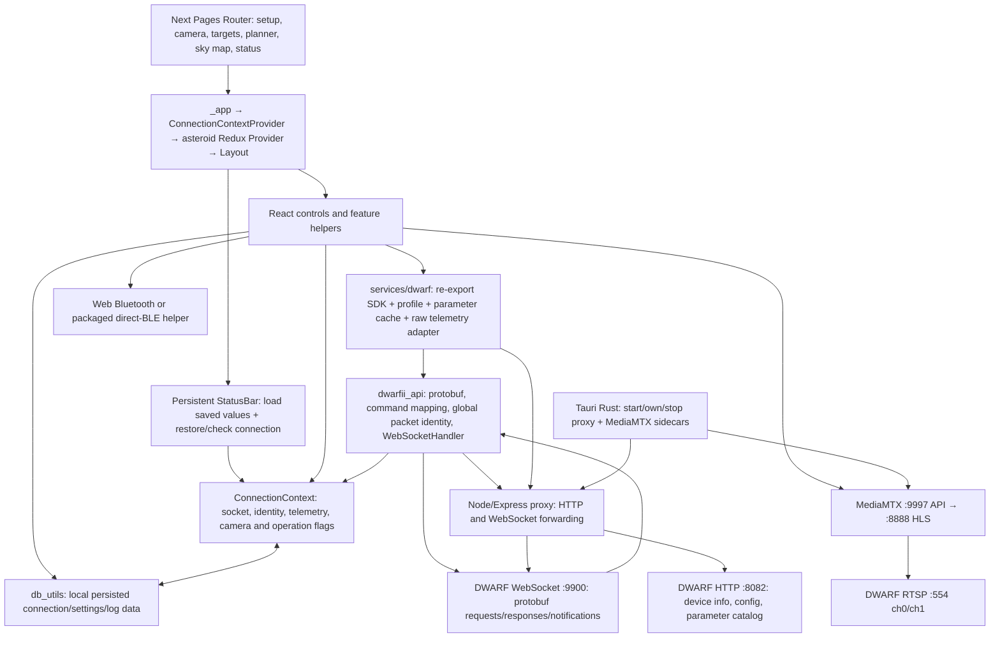

# Protocol architecture and reviewed inventory decisions

This document describes the **pre-migration baseline** at Dwarfium
`b9cb82286af22299a6eef15fe7d118e0d3164126`. It is not a hardware certification or a
description of all subsequent migration changes. The resulting implementation
and validation status belong in [protocol-migration-audit.md](protocol-migration-audit.md).
The exhaustive occurrence report is [protocol-usage-inventory.md](protocol-usage-inventory.md).

No telescope was contacted for this audit. Previously captured behavior in the
research repository is cited as existing evidence, not a live test performed
during this task. Mini testing remains behind the user's automated-validation
and explicit-permission gate; focus and mount movement require separate consent.

## Architecture

The baseline service boundary is mostly an import facade: it re-exports raw SDK
functions and protobuf types. Packet creation, request preparation and response
interpretation still occur in React components and the large `lib/*_utils.ts`
helpers. The intended migration is a semantic device service backed by the shared
SDK, with one session owner feeding authoritative state into the existing UI.
An unrelated Redux rewrite is not required to achieve that separation.

### A1 — Pages, shell and unrelated state

- `src/pages/_app.tsx` owns `ConnectionContextProvider`, the asteroid API Redux
  provider and persistent `Layout`. `next.config.js` uses Pages Router, Strict
  Mode, trailing slashes and `dist`; an external HTTP proxy URL selects static
  export. This is still supported by the installed Next Pages Router guide.
- `src/components/shared/Layout.tsx` renders navigation, `StatusBar`, content,
  footer and theme controls. `StatusBar` calls both `useLoadIntialValues` and
  `useSetupConnection`. Page changes should not create a second telescope owner.
- `src/components/asteroids/api/store.ts` configures RTK Query for the asteroid
  catalog only. Telescope state is **not** stored in Redux at this baseline.
- Weather/clouds, moon/calendar, image editing and most catalog calculations are
  not DWARF protocol implementations. Their use of numbers such as 10000 or a
  historical target name must not be mistaken for a command ID.

### A2 — Device commands and API imports

| Entry point                                          | Responsibility at baseline                                                                                            | Migration boundary                                              |
| ---------------------------------------------------- | --------------------------------------------------------------------------------------------------------------------- | --------------------------------------------------------------- |
| `setup/ConnectDwarf.tsx`, `setup/ConnectDwarfII.tsx` | Setup form/header connect action → `connectionHandler`                                                                | Semantic connect/disconnect                                     |
| `setup/ConnectDwarfSTA.tsx`                          | GATT selection, raw BLE requests, provisioning and polling                                                            | Shared current BLE schemas + provisioning service               |
| `setup/CmdHostLockDwarf.tsx`                         | Raw master-lock packet and status changes                                                                             | Correlated ownership negotiation                                |
| `lib/connect_utils.ts`                               | Discover model, configure global protocol, create socket, attach callbacks, poll, mutate all connection/capture state | Single session and notification reducer                         |
| `components/DwarfCameras.tsx`                        | Preview selection, camera state command, preview packet preparation                                                   | Camera/preview service                                          |
| `lib/dwarf_utils.ts`                                 | Exposure/gain/filter/ISP reads and writes, multiple legacy fallback commands                                          | Mode/camera-scoped parameter service                            |
| `lib/photo_utils.ts`                                 | Photo, video, burst, time-lapse and panorama command workflows                                                        | Verified per-operation services/capability gates                |
| `lib/goto_utils.ts`                                  | Clock, calibration, GOTO, tracking, EQ, motor reset/position, power                                                   | Motion/system service with units and authoritative completion   |
| `imaging/ImagingMenu.tsx`                            | Astro settings/start/continue/stop, tracking and focus packets                                                        | Astro/focus operations; UI expresses intent only                |
| `imaging/CameraJoystick.tsx`, `CameraAddOn.tsx`      | Angle/vector and fixed-step packets                                                                                   | Validated joystick service and safe stop                        |
| Targets, planner, sky map, calibration/EQ components | Supply target/coordinates to common helpers                                                                           | Retain application coordinates; convert once in device boundary |
| `services/dwarf/api.ts`                              | SDK re-exports, inherited socket subclass, raw packet construction                                                    | Temporary facade to replace, not proof migration is complete    |

Moving an import from `dwarfii_api` to `services/dwarf` does not by itself remove
raw protocol ownership from a component. The occurrence inventory therefore
records both the import edge and each call/constant/state branch.

### A3 — Connection and session lifecycle

`connectionHandler` obtains HTTP identity through `findDeviceInfo`, chooses a
profile, reuses or creates the SDK socket, configures proxy/direct transport and
sets callbacks. The initial prepared packet group mixes snapshot, enter-camera
and preview-quality requests. This needs sequencing: transport open, valid
identity, ownership and ready state are different facts.

The baseline `useSetupConnection` also POSTs `firmwareVersion` with `no-cors` and
can mark the device connected on a resolved fetch without validating the
WebSocket session. Its mount-time effect captures state and conditionally clears
intervals. That independent authority can conflict with socket close/reconnect
callbacks, especially under Strict Mode and saved-state restoration.

`services/dwarf/api.ts` subclasses the old SDK handler to suppress rapid-close
loops, inspect raw snapshot telemetry and poll every ten seconds. It informs a
protocol-response callback whenever any decodable envelope has a finite command
number. A malformed/unknown/error payload must not become readiness evidence.
Repeated short connections do not independently prove a master conflict.

`setDwarfClientID`, `setDwarfDeviceID` and `setDwarfMinorVersion` mutate shared SDK
globals. The profile configuration also overwrites the setup page's custom client
selection. Identity belongs to a session; request correlation must use actual
`(module_id, cmd)` keys, with one outstanding same-key request and explicit
evidenced alternate response keys. There is no protobuf transaction ID to invent.

### A4 — State, notifications, telemetry and persistence

`src/stores/ConnectionContext.tsx` contains independent React states for identity,
socket, ready/slave flags, battery, storage, temperature, stream and camera
parameters, imaging stages, focus, tracking and GOTO. `src/types.ts` describes
this large mutable interface. The connection/helper callbacks directly invoke
setters; many `data.code`, `data.state` and generic `OperationState` branches are
therefore explicitly inventoried, rather than assumed correct because the enum
name still compiles.

`src/db/db_utils.ts` persists connection intentions, addresses, timestamps,
preferences, lists and logs locally. Restored `connected=true` is remembered
intent, not current hardware state. IP/mode changes and reconnect must invalidate
pending operations and stale telemetry/camera/capture values.

`services/dwarf/telemetry.ts` manually parses selected fields of 16405 to
compensate for the SDK's incomplete schema. It is an application-layer workaround
to remove once the canonical shared protobuf graph is generated. Preserve field
presence, including legitimate zero battery/temperature/storage values; do not
render a missing field as a valid zero.

`services/dwarf/cameraParams.ts` keeps a module-global catalog and authoritative
parameter map. Its notification handling decodes a parameter ID but applies some
values by index without preserving complete camera/category/shooting-mode scope.
A wide/photo update must not overwrite tele/astro settings, and values must not
survive a different device session. `data_utils.ts` and `data_wide_utils.ts` still
consume static DWARF 2/3 configuration fixtures plus Mini-derived tables; these
are model-specific fallbacks, not runtime capability discovery.

### A5 — Network proxy and live preview

- `server/server.ts` owns the Node/Express HTTP proxy and `ws` upgrade forwarding;
  it is compiled/packaged by `server/build-server.ts` and
  `scripts/package-server.js`. Generated `server/server.js` is ignored output.
- `src/pages/api/proxy.ts` supplies the Next HTTP proxy variant; it is not a
  replacement WebSocket server in a static export. `get_proxy_url.ts` and
  `proxyClient.ts` select browser/Tauri/external proxy routes.
- The proxy's baseline WS forwarding infers text/binary behavior by attempting
  JSON decoding from buffers and special-casing ping/pong. Forwarding should
  preserve the actual `isBinary` frame property rather than reinterpret opaque
  protobuf bytes. Messages emitted before the target opens need an explicit
  failure/queue policy, not silent dropping.
- Mini/DWARF 3 live previews are RTSP sources bridged by MediaMTX to HLS. The
  configuration uses `ch0/stream0` for tele and `ch1/stream0` for wide, HLS 8888 and
  management API 9997. The `v3` in the MediaMTX management URL is **not** a DWARF
  protocol-version field.
- `install/config/mediamtx*.yml` contains a historical source IP. Runtime path
  updates in `get_dwarf_type.ts` must target the connected device before the
  first preview request. A working proxy or MediaMTX health endpoint does not
  establish telescope ownership, camera readiness or a live frame.
- `telephotoURL`/`wideangleURL` return old 8092 MJPEG routes and remain meaningful
  only behind an evidenced model/transport guard. Never show dummy imagery as a
  successful live preview.

### A6 — Tauri, standalone and build/configuration

`src-tauri/tauri.conf.json` bundles `DwarfiumProxy` and `mediamtx` as external
binaries and includes their configuration resources. `src-tauri/src/main.rs`
starts both sidecars, records stdout/stderr/exit events in the app log directory,
chooses HTTPS MediaMTX configuration based on the proxy port and kills owned
children on app exit. These are service-process concerns, not another DWARF
protocol implementation.

`scripts/copy-tools.js`, `prepareDist.js`, `prepareProxy.js`, `prepareServer.js`
and the build workflows select architecture-specific proxy/MediaMTX artifacts.
The standalone launch script starts the same local services plus the app server;
Tauri hosts the frontend in its WebView. `install/start_dwarfium.py` is another
launcher, not a protobuf codec. Environment/proxy port variables and Tauri
capabilities must remain separate from telescope command IDs. No environment
secret values are included in this report.

The normal development checks are the actual package scripts (`CI`, `test`,
`build`), including `postbuild` for the proxy and copied tools. A green Next build
does not prove that an independently packaged BLE executable uses the new SDK.

### A7 — Real compatibility aliases versus live legacy dictionaries

`src/pages/dwarfii-status.tsx` re-exports the current device-status page. It is a
URL compatibility alias, not a separate V2 status decoder. `ConnectDwarfII` is
the generic shared connect button and calls the same connection helper. The
translation keys containing `DwarfII` are also stable names consumed by generic
model-aware setup components; names alone are not grounds for removal. Some
localized prose still recommends old Bluetooth/host workarounds and needs review.

Conversely, `data/dwarfii_codes.js` is **live**, imported by
`components/LogMessageItem.tsx`. It duplicates old command/error meanings and has
no current service registry authority. It cannot be declared dead just because
the new service exists. Unknown errors must retain numeric values rather than
becoming success or an inaccurate familiar V2 explanation.

### A8 — Confirmed retired sensor subtree

`src/lib/witmotion/` and `src/components/witmotion/` reference each other, but no
current Next page, `_app` or imported application component reaches them through
the reviewed static import graph. The current polar-alignment page imports
`EQSolving` and `DwarfCameras`, not the external-sensor provider. The About-page
attribution is a URL, not a module import. This is a specific dead-code finding,
not permission to remove every file without a direct textual caller. Final
removal should also account for unused sensor CSS/attribution and any newly added
imports; no hardware motion is required to verify reachability.

### A9 — Independently packaged legacy BLE implementation

`install/windows/extern/extern.zip` is tracked and extracted by
`src/pages/api/run-ble.ts` and the proxy's helper workflow. The local
`install/extern/dwarf_ble_connect/` directory is ignored extracted output; it is
not the canonical editable source of the archive. The archive contains two
copies (top-level and `lib/`) of old JS SDK wrappers, command mappings, protobuf
sources, generated codecs and WebSocket code, alongside Python BLE wrappers.

The bundled `dist_js/src/api_utils.js` uses the DAF2 client default. Its
`src/proto/ble.proto` predates current client identity fields and the package does
not follow Dwarfium's npm lockfile pin. The Python helper imports
`dwarf_python_api.proto.*`; changing the app's JS dependency cannot regenerate
those Python/binary artifacts. BLE's own CRC/length framing is distinct from the
WebSocket envelope: retaining valid BLE framing must not invent a WebSocket CRC.

The scanner reads source entries **inside the committed ZIP**, without
extracting or running them, and hashes the archive/generated codecs. These rows
are classified LEGACY V2 as a separately shipped legacy dependency. That does
not mean every helper line or CRC primitive is intrinsically wrong; it means the
artifact cannot inherit the new SDK's certification. Rebuild from current
reproducible source, or gate that direct-BLE path and report the limitation.
Opaque executables/Python bytecode cannot be certified from their filenames.

### A10 — Explicit unresolved inventory rows

UNKNOWN is intentionally retained for occurrences where there is no adequately
reviewed payload, units, model availability or asynchronous-state evidence. In
particular: old motor absolute/reset commands; panorama/burst/time-lapse support;
some system/power responses; capture/astro helper argument semantics; individual
state-setting/response branches; and constants whose numeric presence alone
would overstate capability. Shared-schema/command/notification audits and service
contract tests must resolve or safely gate these before the hardware gate.

The baseline table is not automatically relabeled CURRENT just because a
migration changes a nearby file. Rerun with `--working-tree` for an expanded
post-change occurrence search, then review against the implementation/evidence
matrices. Classifying by the letters `V3`, removing all `DwarfII` names, or treating
all unknown rows as success would invalidate this audit.

## Evidence registry

Research paths below are relative to the locally reviewed dwarfAlp checkout
`C:\Users\Aco\Desktop\Astro-Tools\DwarfAlpa`, commit
`b5a56f00519a1b76ab36d6e445e1d332216816f6`. SDK implementation comparison uses
Dwarfium's pin `4e7d62e33272a401756b3b3207fed442f3978b8d` and the clean sibling
fork's `develop` head `cc4c3c50a8956e378735a1449aa1bd5376359bad`. Recovered
descriptors/APK/captures outrank existing source, comments and old documentation.

| ID  | Reviewed source                                                                                                                                                   | Decision supported                                                                                                                                                | Confidence / limits                                                                                               |
| --- | ----------------------------------------------------------------------------------------------------------------------------------------------------------------- | ----------------------------------------------------------------------------------------------------------------------------------------------------------------- | ----------------------------------------------------------------------------------------------------------------- |
| R1  | `docs/protocol/transport.md`; `src/dwarf_alpaca/dwarf/ws_client.py`; master-lock tests/session code                                                               | Exact eight-field envelope; no sequence/CRC; module+cmd correlation, alternate ownership response; transport is not readiness                                     | VERIFIED framing; session behavior HIGH from canonical implementation and existing captures, no new hardware test |
| R2  | `docs/protocol/firmware-comparison.md`; recovered descriptor/schema audit                                                                                         | 16404 enter camera; 10050/12036 quality; 15011 infinity read; 15261 system-I/O task; 15296 sky-target finder; local-only camera disconnect in prior Mini research | VERIFIED firmware; referenced Mini disconnect behavior previously live-verified in research, not this task        |
| R3  | `docs/apk-analysis/camera-parameters.md`; canonical `param.proto`; capture-workflow research                                                                      | Exposure is a lookup code; uint64 namespace; mode/camera-aware catalog; filters and normal ranges differ; parameters precede capture                              | VERIFIED APK/schema; runtime options remain authoritative                                                         |
| R4  | `docs/protocol/UNRESOLVED.md`; firmware command audit                                                                                                             | Registry entries do not establish availability; 14001/14003–05 and panorama 15502 remain compatibility only                                                       | UNKNOWN availability deliberately retained                                                                        |
| R5  | `src/dwarf_alpaca/proto/{base,protocol,task_center,param,camera,astro,focus,motor_control,notify,ble,system,rgb,panorama}.proto`; `tests/test_protocol_golden.py` | Exact fields, signedness, optional/oneof structure, command-specific payload and known golden bytes                                                               | VERIFIED where descriptor/golden provenance exists; schema presence alone is not a supported workflow             |
| R6  | `src/dwarf_alpaca/device_profile.py`; `tests/test_device_profiles.py`; APK camera tables                                                                          | Separate hardware model, wire profile, DAF client ID, camera/filter/focus differences                                                                             | HIGH canonical/model tests; DWARF 3 not live-tested here                                                          |
| R7  | Canonical `ble.proto`; APK transport research; bundled ZIP BLE sources                                                                                            | Current BLE client identity fields and distinct BLE framing; independent old packaged implementation                                                              | VERIFIED schema conflict; packaged executable provenance/behavior UNKNOWN                                         |
| R8  | Research `dwarf/http_client.py`, session HTTP calls and transport docs; application HTTP/stream routing                                                           | 8082 device/config routes; 9900 control; model-specific RTSP versus MJPEG and application-local HLS service                                                       | HIGH source/capture evidence; availability is not a readiness predicate                                           |

Important conflict: older APK/profile prose describes DWARF 3 legacy defaults
1.2/device 1, while the current canonical profile/tests select 1.20 and wire device
4 with the DAF3 client, separately from hardware model ID 2. The current
application instead conflates hardware ID with wire ID and uses DAF2 for DWARF 3.
Resolve this in the shared model profile using the stronger/current evidence;
do not copy Mini wholesale or claim DWARF 3 hardware certification.

## Audit-tool provenance and validation

The scanner uses the installed TypeScript 5.9.3 AST parser for import aliases,
calls, constants and source locations, plus textual searches for schemas,
configuration, ports and historical assumptions. Context7 validation used
`/microsoft/typescript/v5.9.3` and the official compiler API linter/import examples.
An unzipper Context7 lookup returned no matching package; read-only archive
`Open.buffer` and entry `buffer()` calls follow the installed package README.
No package or global tooling was added. No proprietary protocol fact was sourced
from Context7.

Release-review note: the application/API and research repositories have differing
license declarations. Retain exact source provenance and review compatibility of
any copied canonical files before external distribution; this audit does not
relicense either project or claim that a local candidate is a published release.

The scanner's report records its source HEAD and hashes archive artifacts.
Generated codecs are audited through their source/provenance rather than
expanded into tens of thousands of misleading duplicate semantic findings.
Application test assertions are classified alongside production calls, never
used to turn a known incorrect old wire expectation into evidence.
